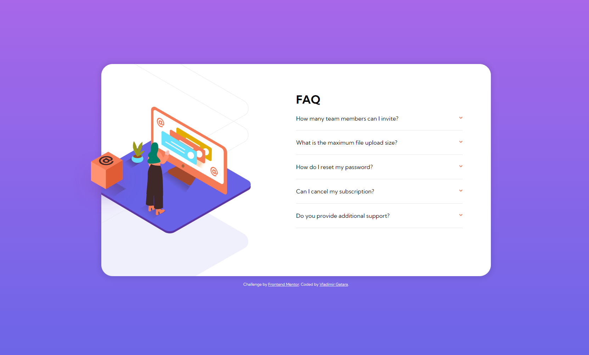

# Frontend Mentor - FAQ accordion card solution

This is a solution to the [FAQ accordion card challenge on Frontend Mentor](https://www.frontendmentor.io/challenges/faq-accordion-card-XlyjD0Oam). Frontend Mentor challenges help you improve your coding skills by building realistic projects. 

## Table of contents

- [Overview](#overview)
  - [The challenge](#the-challenge)
  - [Screenshot](#screenshot)
  - [Links](#links)
- [My process](#my-process)
  - [Built with](#built-with)
  - [What I learned](#what-i-learned)
  - [Continued development](#continued-development)
- [Author](#author)

## Overview

### The challenge

Users should be able to:

- View the optimal layout for the component depending on their device's screen size
- See hover states for all interactive elements on the page
- Hide/Show the answer to a question when the question is clicked

### Screenshot

 

### Links

- Solution URL: https://github.com/DruxAMB/faq-accordion-card
- Live Site URL: ""
## My process

### Built with

- Semantic HTML5 markup
- CSS custom properties
- Flexbox
- Mobile-first workflow
- [React](https://reactjs.org/) - JS library

### What I learned

How to work with images on absolut position and use of useState.

### Continued development

Need more react :)

## Author

- Website - [Portfolio](https://druxamb.github.io/DruxAMB-Portfolio/)
- Frontend Mentor - [DruxAMB](https://www.frontendmentor.io/profile/DruxAMB)
- Twitter - [DruxAMB](https://twitter.com/DruxAMB])
